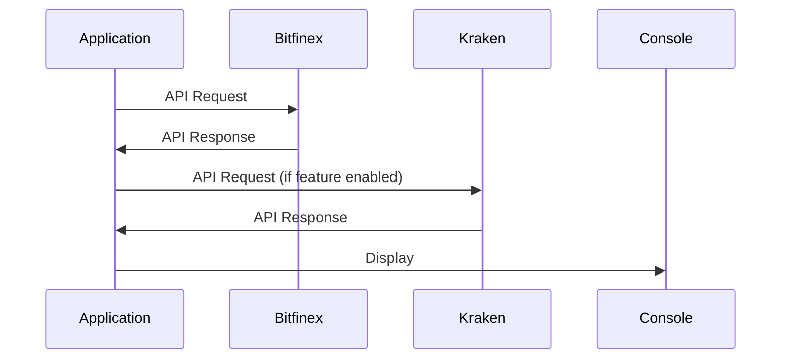

# Exchange Scrapper

The goal for this project is to expose the Average/Min/Max of every BTC/EUR trades in the last hour using the Bitfinex API to fetch the data. 

A periodic timer job was created to make sure the data is fetched every 10 seconds (even though this is configurable).

The application is ready to support multiple collectors besides Bitfinex. An example was made with Kraken API to illustrate it.

## Running locally using dotnet cli

Requires C# .NET 7.0.

run `dotnet run --project ExchangeScrapper`

## Running locally using Docker

Requires docker.

- Builder docker image: run `docker build -t exchange-scrapper:local -f Dockerfile .`
- Spin up container: run `docker compose -f .\docker-compose-local.yml up`

### Testing the service

run `dotnet test`

## Implementation

For the trade summary use case, execution flow is as follows:

